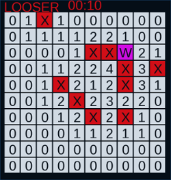

# Mine app

Mine app is a simple minesweeper clone. It uses the SFML library for the GUI. It is a project that I made with my sister to teach her the usage of OOP and mutiple files.

## Dependencies

You need to have the SFML library on your include path. The simple way is to

`sudo apt-get install libsfml-dev`

Refer to the [SFML](https://www.sfml-dev.org/tutorials/2.5/start-linux.php) page for more information. 

## How to run?

Just run the shell script `compile-and-run`, it will compile and run the application (no kidding...). You can use the `mine-app` to run it after

